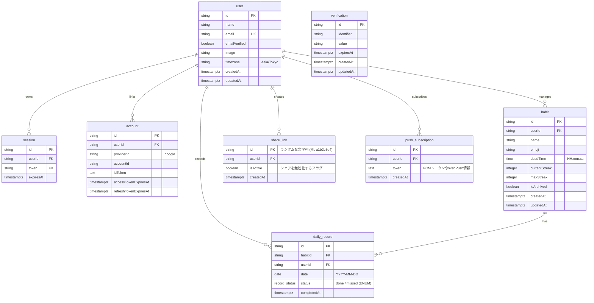

## ER図 (Entity-Relationship Diagram)

Better Auth向けのテーブル
- user (timezoneは独自カラム)
- session
- account
- verification

## OGPシェア機能の仕組み (share_link)

URLの生成: ユーザーが「シェア」ボタンを押すと、share_link テーブルに新しいレコードを作成し、その id (短縮ID) を含めたURL (https://dailygreen.app/share/[id]) を発行します。

OGP画像の動的生成: XなどのクローラーがこのURLにアクセスすると、サーバー（Next.jsのAPIルートなど）は share_link テーブルから userId を引き出し、そのユーザーの最新の habit と daily_record を取得してOGP画像（草のグラフなど）を動的に生成して返します。

プライバシー管理: isActive を false にすることで、過去にシェアしたリンクからのアクセスやOGP表示を即座に遮断できます。

## プッシュ通知機能の仕組み (push_subscription)

複数デバイストークンの管理: ユーザーがブラウザやアプリで「通知を許可」した際、発行されるデバイストークン（またはWeb Pushの購読情報）を push_subscription テーブルに保存します。1人のユーザーがスマホとPCの両方で許可した場合、2つのレコードが作成されます。

バッチ処理での配信: 定期実行されるジョブがデッドタイムの迫っている習慣を持つユーザーを抽出し、このテーブルに紐づく全ての端末宛てに「デッドタイム30分前です！」といった通知を送信します。
