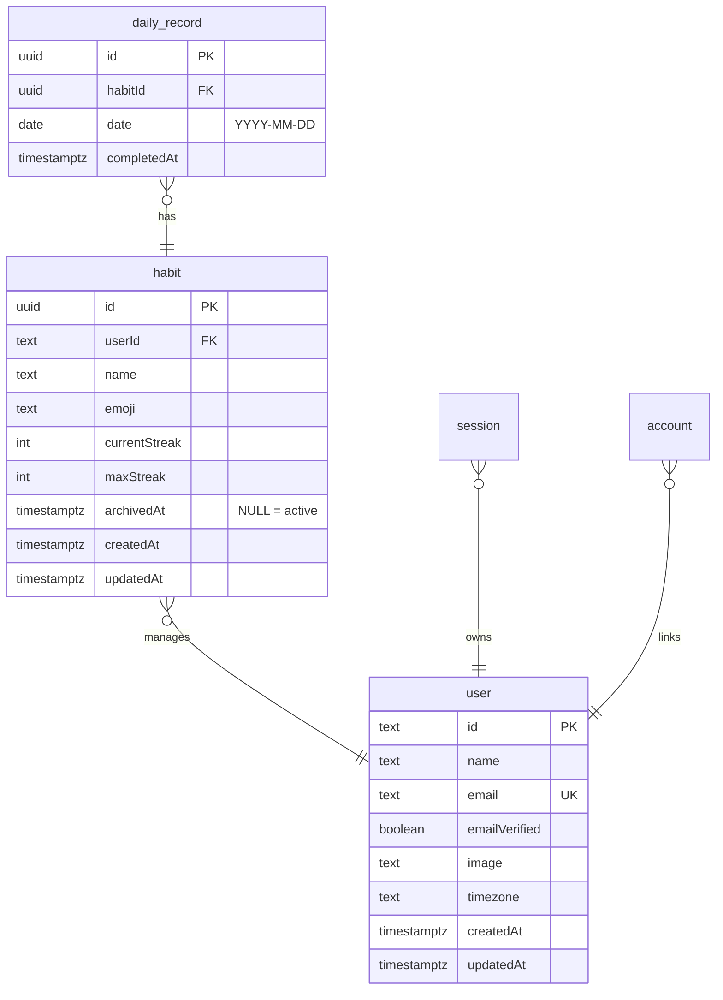

# Daily Green DB 設計書

## 1. 位置づけ

この文書は **現在のアプリケーションスキーマ** を説明する。

現行スキーマの実装上の source of truth は [`web-app/src/db/schema.ts`](../web-app/src/db/schema.ts)。`web-app/drizzle/` 配下は過去から現在までの migration 履歴であり、初期 migration に現在は存在しないカラム・テーブルが含まれていても削除しない。

## 2. 現行テーブル

アプリ固有テーブルは次の2つ。

- `habit`
- `daily_record`

これに Better Auth の認証テーブルを利用する。

- `user`
- `session`
- `account`
- `verification`

現在のスキーマには `share_link` / `push_subscription` は存在しない。

```mermaid
erDiagram
    daily_record }o--|| habit : "has"
    habit }o--|| user : "manages"
    session }o--|| user : "owns"
    account }o--|| user : "links"

    habit {
        uuid id PK
        text userId FK
        text name
        text emoji
        int currentStreak
        int maxStreak
        timestamptz archivedAt "NULL = active"
        timestamptz createdAt
        timestamptz updatedAt
    }

    daily_record {
        uuid id PK
        uuid habitId FK
        date date "YYYY-MM-DD"
        timestamptz completedAt
    }

    user {
        text id PK
        text name
        text email UK
        boolean emailVerified
        text image
        text timezone
        timestamptz createdAt
        timestamptz updatedAt
    }
```

## 3. `habit`

ユーザーごとの習慣マスタ。

- `id`: UUID primary key
- `userId`: Better Auth `user.id` への FK。user 削除時は cascade
- `name`: 習慣名
- `emoji`: 任意の絵文字。未設定時は空文字
- `currentStreak`: 現在の連続達成日数
- `maxStreak`: 過去最高の連続達成日数
- `archivedAt`: `NULL` の間だけ active
- `createdAt`: 作成日時
- `updatedAt`: 更新日時

`habit_user_id_archived_at_id_idx(userId, archivedAt, id)` を持つ。

active habit はユーザーあたり最大10件、アーカイブ済みを含む総数は最大1000件とする。上限判定と insert は並行作成でも上限を超えないようアプリケーションの transaction で直列化する。

## 4. `daily_record`

達成した事実だけを保存する。

- `id`: UUID primary key
- `habitId`: `habit.id` への FK。habit 削除時は cascade
- `date`: JST 基準の達成日 `YYYY-MM-DD`
- `completedAt`: 実際の達成操作時刻

`UNIQUE(habitId, date)` により同一習慣・同一日の重複達成を防ぐ。

未達成日はレコードを作成しない。`status`、`missed`、遅延達成用の状態は持たない。

## 5. 認証テーブル

Better Auth の標準構造を利用する。

- `user`
- `session`
- `account`
- `verification`

`user.timezone` は現在も保持するが、Daily Green の業務日付は JST 固定であり、日付切り替え判定には利用しない。

OAuth token を保存する場合の扱いは [operations.md](./operations.md) を参照する。

## 6. 日付・時刻

- `timestamptz` は絶対時刻として保存する
- 業務日付は JST（Asia/Tokyo）固定
- DB session timezone に依存して日付境界を判定しない
- 日付 D の境界はアプリケーション側で `D 00:00 JST` から `D+1日 00:00 JST` の半開区間として扱う
- API の `date-time` は JST オフセット `+09:00` を持つ RFC 3339 文字列へ変換する

## 7. Activity Log 集計

Activity Log は表示時点で active な習慣だけを対象に都度集計する。

- 日付 D の対象習慣: `createdAt < D+1日 00:00 JST` かつ `archivedAt IS NULL`
- 分母: 対象習慣数
- 分子: 対象習慣に属する `daily_record` のうち `date = D` の件数
- archive 済み習慣は過去日の分子・分母からも除外する
- 当日は未確定なので `completionRate = null`
- 過去日でも分母が0なら `completionRate = null`

この設計では archive 後に過去日の Activity Log が変化し得る。

## 8. ストリーク

- complete 時に `currentStreak` / `maxStreak` を更新する
- 未達成による reset は定期バッチでは行わない
- ホーム画面取得前の Lazy Update で期限切れの `currentStreak` を `0` にする
- Lazy Update は履歴からの完全再計算ではない

## 9. Migration 履歴について

初期 migration `0000_regular_deathstrike.sql` には、初期設計時点の以下が含まれている。

- `record_status`
- `daily_record.status`
- `habit.deadTime`
- `habit.isArchived`
- `share_link`
- `push_subscription`

これらは後続 migration で削除・置換済み。

- `0001_regular_inhumans.sql`: `status` / `deadTime` / `isArchived` / `record_status` を削除し、`archivedAt` へ移行
- `0002_bright_mathemanic.sql`: `share_link` / `push_subscription` を削除
- `0003_thick_warhawk.sql`: active habit 取得向け index を追加

**過去 migration や対応する Drizzle snapshot は、適用済み環境を再現するための履歴なので削除・書き換えない。**

## 10. シェア機能との関係

ソーシャルシェア v1 は DB を使用しない。

共有用 PNG はブラウザの Canvas で生成し、サーバーへ保存しない。公開 URL も発行しないため、`share_link` のようなテーブルは不要である。
