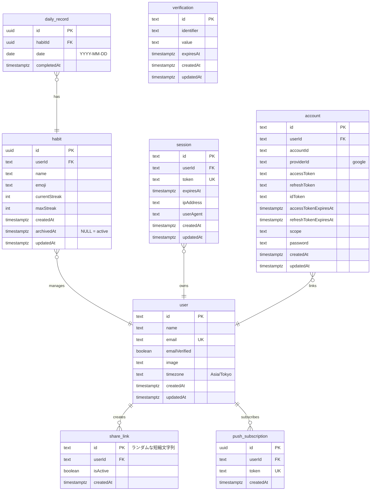

# Daily Green DB 設計書

## 1. 設計方針

- 本書は、現行実装そのものではなく、今回合意した MVP 要件に合わせて更新する目標 DB 設計を記述する
- 認証は Better Auth を前提とし、ゲスト利用は扱わない
- 習慣は毎日繰り返す単位で管理し、習慣自体に終了期限は持たせない
- 時刻は全て JST（Asia/Tokyo）で扱う
- `daily_record` は未達成管理テーブルではなく、達成時のみ作成される達成記録テーブルとして扱う
- 未達成はレコード欠損で表現し、`record_status` のような状態カラムは持たない
- Activity Log の過去日の分母を再現できるよう、`habit.createdAt` と `habit.archivedAt` を保持する
- `habit.currentStreak` と `habit.maxStreak` は参照しやすさのために保持するが、`currentStreak` はホーム画面取得前に補正可能な運用を前提とする

### 1.1 現行実装との差分

現行の Drizzle スキーマ (`web-app/app/db/schema.ts`, `web-app/drizzle/0000_regular_deathstrike.sql`) には、MVP 目標設計へまだ追従していないカラムが残っている。

- `habit.deadTime`: 現行では必須だが、MVP では全習慣で締め時刻を **翌日 00:00**（当日 24:00 と同義）として扱うため、個別期限としては使わない
- `habit.isArchived`: 現行では boolean 管理だが、MVP 目標設計では過去日の分母固定に対応するため `archivedAt` で扱う
- `daily_record.status (record_status)`: 現行では必須だが、MVP では達成時のみ記録を残すため不要とする

この差分は、今回のドキュメント更新後に別途スキーマ変更で追従する前提とする。

## 2. ER 図

Better Auth 向けの標準テーブルに、アプリ固有の習慣管理テーブルを加える。以下の ER 図は、上記の MVP 目標設計に対応した将来形を示す。

```mermaid
erDiagram
    direction TB
    daily_record }o--|| habit : "has"
    habit }o--|| user : "manages"
    session }o--|| user : "owns"
    account }o--|| user : "links"
    user ||--o{ share_link : "creates"
    user ||--o{ push_subscription : "subscribes"

    daily_record {
        uuid id PK
        uuid habitId FK
        date date "YYYY-MM-DD"
        timestamptz completedAt
        %% UK: habitId と date の複合ユニーク制約
    }

    habit {
        uuid id PK
        text userId FK
        text name
        text emoji
        int currentStreak
        int maxStreak
        timestamptz createdAt
        timestamptz archivedAt "NULL = active"
        timestamptz updatedAt
    }

    user {
        text id PK
        text name
        text email UK
        boolean emailVerified
        text image
        text timezone "Asia/Tokyo"
        timestamptz createdAt
        timestamptz updatedAt
    }

    session {
        text id PK
        text userId FK
        text token UK
        timestamptz expiresAt
        text ipAddress
        text userAgent
        timestamptz createdAt
        timestamptz updatedAt
    }

    account {
        text id PK
        text userId FK
        text accountId
        text providerId "google"
        text accessToken
        text refreshToken
        text idToken
        timestamptz accessTokenExpiresAt
        timestamptz refreshTokenExpiresAt
        text scope
        text password
        timestamptz createdAt
        timestamptz updatedAt
    }

    verification {
        text id PK
        text identifier
        text value
        timestamptz expiresAt
        timestamptz createdAt
        timestamptz updatedAt
    }

    share_link {
        text id PK "ランダムな短縮文字列"
        text userId FK
        boolean isActive
        timestamptz createdAt
    }

    push_subscription {
        uuid id PK
        text userId FK
        text token UK
        timestamptz createdAt
    }
```

## 3. テーブル定義

### 3.1 `habit`

ユーザーごとの習慣マスタ。MVP では毎日繰り返す習慣のみを扱う。

- `name`: タスク名。ホーム画面ではこの値で昇順ソートする
- `emoji`: 習慣カードに表示する任意のアイコン。未設定の場合は空文字とする (NOT NULL)
- `currentStreak`: 直近の連続達成日数
- `maxStreak`: 過去最高の連続達成日数
- `createdAt`: 習慣が対象になった開始日時
- `archivedAt`: アーカイブ日時。`NULL` の間だけホーム画面の対象習慣とする
- `updatedAt`: 習慣情報の更新日時

`archivedAt` を持たせることで、「現在は非表示だが、過去のある日には対象習慣だった」状態を判定できる。
MVPでは期限は全習慣共通で **翌日 00:00**（当日 24:00 と同義）のため、習慣ごとの `deadTime` カラムは持たない。

### 3.2 `daily_record`

達成記録テーブル。未達成を表すテーブルではない。

- レコードは習慣を当日中に達成したときだけ作成する
- 未達成日はレコードを作成しない
- `date` は確定した達成日
- `completedAt` は実際に達成操作を行った時刻
- `UNIQUE(habitId, date)` により、同一習慣・同一日付の重複達成を防ぐ

`status` カラムは持たない。MVP では `done` / `missed` の状態を 1 行で表さず、「達成した日だけ行がある」設計とする。

### 3.3 認証関連テーブル

Better Auth の標準テーブルを利用する。

- `user`
- `session`
- `account`
- `verification`

`user.timezone` カラムは現行 Better Auth 拡張の保持項目として残るが、MVP の日付切り替え、締め時刻判定、`daily_record.date` の解釈には使用しない。

### 3.4 補助テーブル

- `share_link`: シェア用 URL を発行するためのテーブル
- `push_subscription`: 通知先デバイスを保持するためのテーブル

これらは MVP の中核ロジックではないが、認証済みユーザーに紐づく補助情報として分離して持つ。

## 4. 制約と運用ルール

### 型とキーの方針

- 認証系テーブル (`user`, `session`, `account`, `verification`) と、それを参照する `userId` は Better Auth に合わせて `text` 型とする
- アプリ固有テーブル (`habit`, `daily_record`, `push_subscription`) の ID は `uuid` 型とする
- `share_link.id` は共有 URL 用の短いランダム文字列を使うため `text` 型とする
- `push_subscription.token` は二重送信防止のため `UNIQUE` 制約を持たせる

### `daily_record` の整合性

- `daily_record` には `userId` を持たせず、`daily_record -> habit -> userId` で所有者を特定する
- 所有者情報は `habit` 経由で一元管理し、`daily_record` 側に `userId` を重複保持しないことで「`daily_record.userId` と `habit.userId` の不整合」が起こらないようにする
- 達成記録の重複防止は `UNIQUE(habitId, date)` で保証する
- 他ユーザーの習慣へ記録を付けない保証は、DB ではなくアプリケーション側の認可処理（ログインユーザーと `habit.userId` の照合）で担保する

### Activity Log の分母固定

各日付の Activity Log では、その日付時点の対象習慣数を分母として達成率を求める。過去日の分母を後から変えないため、日付ごとの対象習慣数は `habit.createdAt` と `habit.archivedAt` を使って判定する。

- `createdAt` により、その日までに存在していた習慣かを判定する
- `archivedAt` により、その日付時点でまだ対象だったかを判定する
- 判定境界は各日付が終わる翌日 `00:00` とし、`archivedAt = D+1日 00:00` ちょうどのアーカイブは、その日が終わるまでは対象だったものとして日付 D の分母に含める
- これにより、後日アーカイブされた習慣があっても、過去日の Activity Log の色を同じ条件で再計算できる

実装上は、JST で見た各日付が終わる翌日 `00:00` 時点を基準に対象習慣数を求める想定とする。

### ストリークの扱い

- 習慣達成時に `currentStreak` を増やし、必要に応じて `maxStreak` を更新する
- 未達成によるストリーク切れはバッチで反映しない
- その代わり、ホーム画面取得前に `daily_record` の履歴を基に `currentStreak` を補正する
- ホーム画面には補正後の値を返す

このため `currentStreak` は厳密な唯一ソースではなく、達成記録から補正可能なキャッシュ値として扱う。

## 5. 補足

- 本設計では `deadTime`、`record_status`、`missed` レコードを前提としない
- 期限後達成は存在しないため、`daily_record` に遅延達成を表す状態や列は不要
