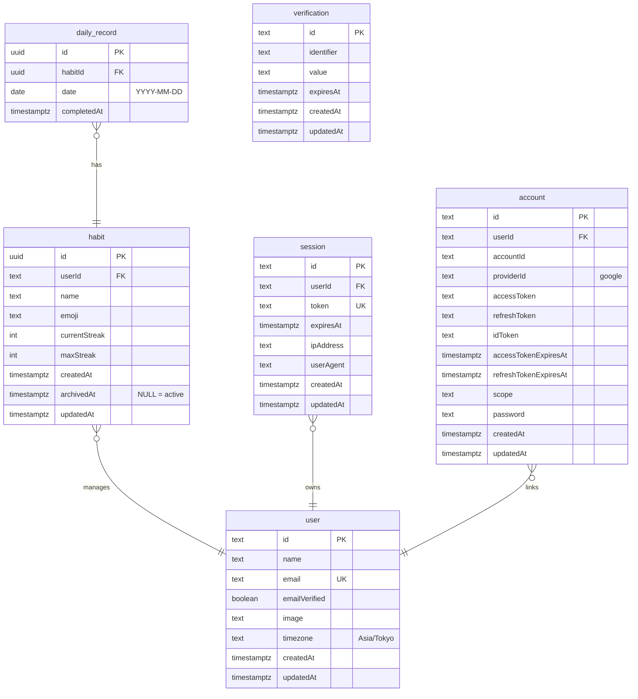
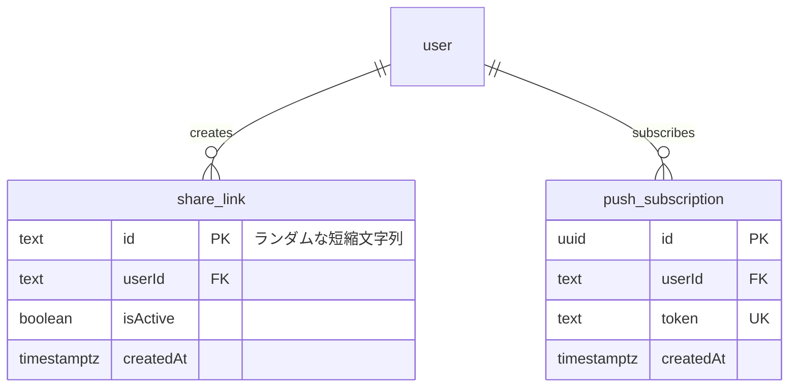

# Daily Green DB 設計書

## 1. 設計方針

- 本書は、現行実装そのものではなく、今回合意した MVP 要件に合わせて更新する目標 DB 設計を記述する
- 認証は Better Auth を前提とし、ゲスト利用は扱わない
- 習慣は毎日繰り返す単位で管理し、習慣自体に終了期限は持たせない
- `timestamptz` は絶対時刻として保存し、JST（Asia/Tokyo）の日付境界への変換はアプリケーション側で行う
- `daily_record` は未達成管理テーブルではなく、達成時のみ作成される達成記録テーブルとして扱う
- 未達成はレコード欠損で表現し、`record_status` のような状態カラムは持たない
- Activity Log は表示時点で `archivedAt IS NULL` の習慣だけを対象とし、`createdAt` は各日付で習慣が作成済みだったかの判定に使用する
- `habit.currentStreak` と `habit.maxStreak` は参照しやすさのために保持する。ホーム画面取得時の Lazy Update は、期限切れの `currentStreak` を `0` にする処理に限定する

## 2. ER 図

### 2.1 MVP 必須テーブル

MVP で実装対象とするのは、Better Auth の標準テーブルと `habit`、`daily_record` である。

```mermaid
erDiagram
    direction TB
    daily_record }o--|| habit : "has"
    habit }o--|| user : "manages"
    session }o--|| user : "owns"
    account }o--|| user : "links"

    daily_record {
        uuid id PK
        uuid habitId FK
        date date "YYYY-MM-DD"
        timestamptz completedAt
        %% UK: habitId と date の複合ユニーク制約
    }

    habit {
        uuid id PK
        text userId FK
        text name
        text emoji
        int currentStreak
        int maxStreak
        timestamptz createdAt
        timestamptz archivedAt "NULL = active"
        timestamptz updatedAt
    }

    user {
        text id PK
        text name
        text email UK
        boolean emailVerified
        text image
        text timezone "Asia/Tokyo"
        timestamptz createdAt
        timestamptz updatedAt
    }

    session {
        text id PK
        text userId FK
        text token UK
        timestamptz expiresAt
        text ipAddress
        text userAgent
        timestamptz createdAt
        timestamptz updatedAt
    }

    account {
        text id PK
        text userId FK
        text accountId
        text providerId "google"
        text accessToken
        text refreshToken
        text idToken
        timestamptz accessTokenExpiresAt
        timestamptz refreshTokenExpiresAt
        text scope
        text password
        timestamptz createdAt
        timestamptz updatedAt
    }

    verification {
        text id PK
        text identifier
        text value
        timestamptz expiresAt
        timestamptz createdAt
        timestamptz updatedAt
    }

```

### 2.2 将来拡張テーブル

`share_link` と `push_subscription` は将来拡張用であり、MVP のマイグレーション・実装・API の対象外とする。

```mermaid
erDiagram
    user ||--o{ share_link : "creates"
    user ||--o{ push_subscription : "subscribes"

    share_link {
        text id PK "ランダムな短縮文字列"
        text userId FK
        boolean isActive
        timestamptz createdAt
    }

    push_subscription {
        uuid id PK
        text userId FK
        text token UK
        timestamptz createdAt
    }
```

## 3. テーブル定義

### 3.1 `habit`

ユーザーごとの習慣マスタ。MVP では毎日繰り返す習慣のみを扱う。

- `name`: タスク名。習慣一覧は `name`、`createdAt`、`id` の順にすべて昇順でソートする
- `emoji`: 習慣カードに表示する任意のアイコン。未設定の場合は空文字とする (NOT NULL)
- `currentStreak`: 直近の連続達成日数
- `maxStreak`: 過去最高の連続達成日数
- `createdAt`: 習慣が対象になった開始日時
- `archivedAt`: アーカイブ日時。`NULL` の間だけホーム画面の対象習慣とする
- `updatedAt`: 習慣情報の更新日時

`archivedAt` は active 判定に使用する。Activity Log でも、表示時点で `archivedAt IS NULL` の習慣だけを過去日を含む全日付の計算対象とする。
MVPでは期限は全習慣共通で **翌日 00:00 JST**（当日 24:00 と同義）のため、習慣ごとの `deadTime` カラムは持たない。

### 3.2 `daily_record`

達成記録テーブル。未達成を表すテーブルではない。

- レコードは習慣を当日中に達成したときだけ作成する
- 未達成日はレコードを作成しない
- `date` は確定した達成日
- `completedAt` は実際に達成操作を行った時刻
- `UNIQUE(habitId, date)` により、同一習慣・同一日付の重複達成を防ぐ

`status` カラムは持たない。MVP では `done` / `missed` の状態を 1 行で表さず、「達成した日だけ行がある」設計とする。

### 3.3 認証関連テーブル

Better Auth の標準テーブルを利用する。

- `user`
- `session`
- `account`
- `verification`

`user.timezone` カラムは現行 Better Auth 拡張の保持項目として残るが、MVP の日付切り替え、締め時刻判定、`daily_record.date` の解釈には使用しない。

### 3.4 将来拡張テーブル

- `share_link`: シェア用 URL を発行するためのテーブル
- `push_subscription`: 通知先デバイスを保持するためのテーブル

これらは MVP 実装対象外とし、将来導入する場合に認証済みユーザーへ紐づく補助情報として分離して持つ。

## 4. 制約と運用ルール

### 型とキーの方針

- 認証系テーブル (`user`, `session`, `account`, `verification`) と、それを参照する `userId` は Better Auth に合わせて `text` 型とする
- MVP のアプリ固有テーブル (`habit`, `daily_record`) の ID は `uuid` 型とする
- 将来拡張では `push_subscription.id` を `uuid` 型、`share_link.id` を共有 URL 用の短いランダム文字列を格納する `text` 型とする
- 将来 `push_subscription` を導入する場合、`token` は二重送信防止のため `UNIQUE` 制約を持たせる

### `timestamptz` の扱い

- `createdAt`、`archivedAt`、`updatedAt`、`completedAt` などの `timestamptz` は絶対時刻として保存する
- DB セッションのタイムゾーン表現に依存して業務日付を判定しない
- 日付 D の境界 `D 00:00 JST` と `D+1日 00:00 JST` はアプリケーション側で絶対時刻へ変換して比較する
- API で `date-time` を返すときは、アプリケーション側で JST のオフセット `+09:00` を持つ RFC 3339 文字列へ変換する

### habit 件数上限

- active habit（`archivedAt IS NULL`）はユーザーあたり最大 10 件とする
- アーカイブ済みを含む habit 総数はユーザーあたり最大 1000 件とする
- 上限判定と `habit` の INSERT は、同一ユーザーによる並行作成でも上限を超えないようトランザクション内で直列化する
- 直列化には対象 `user` 行の `SELECT ... FOR UPDATE` を使用する。上限判定はロック取得後に行う

### `daily_record` の整合性

- `daily_record` には `userId` を持たせず、`daily_record -> habit -> userId` で所有者を特定する
- 所有者情報は `habit` 経由で一元管理し、`daily_record` 側に `userId` を重複保持しないことで「`daily_record.userId` と `habit.userId` の不整合」が起こらないようにする
- 達成記録の重複防止は `UNIQUE(habitId, date)` で保証する
- 他ユーザーの習慣へ記録を付けない保証は、DB ではなくアプリケーション側の認可処理（ログインユーザーと `habit.userId` の照合）で担保する
- 同じ habit に対する update / archive / complete は共通の排他機構で直列化し、先に成立した処理を優先する
- 共通排他機構には、所有者条件を含めて取得した対象 `habit` 行の `SELECT ... FOR UPDATE` を使用する
- update が先に成立した場合、archive / complete は更新後の `name` / `emoji` を対象に処理する
- archive が先に成立した場合、後続の update / complete はアーカイブ済み状態を検出して失敗し、complete は `daily_record` を残さない
- complete が先に成立した場合、`daily_record` の INSERT と `currentStreak` / `maxStreak` の UPDATE をコミットした後、後続の update / archive が成立する
- `UNIQUE(habitId, date)` 違反は `HABIT_ALREADY_COMPLETED_TODAY`、所有者条件に一致しない取得結果は `HABIT_NOT_FOUND` へ変換する

### Activity Log の集計

Activity Log は、表示時点で active な習慣だけを対象に都度集計する。過去日の分母を当時の状態で固定・再現する設計にはしない。

- 日付 D の対象習慣は、`habit.createdAt < D+1日 00:00 JST` かつ `habit.archivedAt IS NULL` を満たす habit とする
- 分母は、日付 D の対象習慣数とする
- 分子は、対象習慣に属する `daily_record` のうち `date = D` の件数とする
- アーカイブ済み習慣は、過去日の分子・分母からも除外する
- そのため、習慣の archive 後は過去日の `completionRate` と表示色が変わり得る
- 当日は未確定のため `completionRate = null` とし、過去日でも分母が `0` の場合は `completionRate = null` とする

### ストリークの扱い

- 習慣達成時に `currentStreak` を増やし、必要に応じて `maxStreak` を更新する
- 未達成によるストリーク切れはバッチで反映しない
- その代わり、ホーム画面取得前に直近の `daily_record.date` を確認し、`currentStreak > 0` かつ直近達成日が `null` または「昨日」より前の習慣を `0` に更新する
- Lazy Update はこの `0` リセットだけを行い、`daily_record` から連続日数を完全再計算して非ゼロ値へ補正する処理は行わない
- ホーム画面には補正後の値を返す

Lazy Update の読み取りまたは更新に失敗した場合は、補正前の `currentStreak` をレスポンスに使用せず、ホーム画面 API 全体を失敗させる。

## 5. 補足

- 本設計では `deadTime`、`record_status`、`missed` レコードを前提としない
- 期限後達成は存在しないため、`daily_record` に遅延達成を表す状態や列は不要
