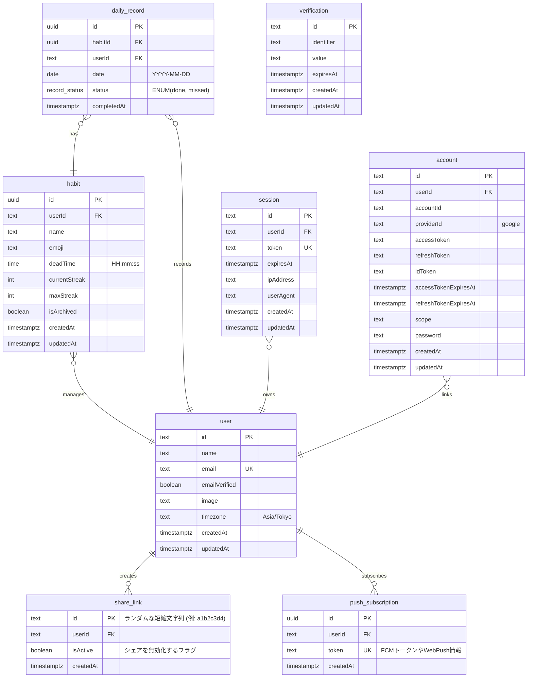

## ER図 (Entity-Relationship Diagram)

Better Auth向けのテーブル（標準カラムを網羅）
- user (timezoneは独自カラム)
- session
- account
- verification

**型の補足:**

* 認証系テーブル (`user`, `session`, `account`, `verification`) の ID と、それを参照する `userId` は、Better Authの仕様に合わせて **`text` 型** とします。
* アプリ固有テーブル (`habit`, `daily_record`, `push_subscription`) の ID は、堅牢な **`uuid` 型**（Drizzleの `defaultRandom()` で自動生成）とします。
* `share_link.id` のみ、URL共有用の短縮ランダム文字列のため `text` 型とします。
* 文字列カラムは特別な制約がない限り `text`。
* `daily_record.status` の `record_status` は PostgreSQL の ENUM 型とし、値は `'done'`（完了）と `'missed'`（未達）。
* **【重要】** `daily_record` テーブルには、`habitId` と `date` の組み合わせに対する **複合ユニーク制約 (UNIQUE)** を設定し、同一日に同じ習慣が複数回記録されるのをデータベースレベルで防ぎます。
* `push_subscription.token` は重複登録による二重送信防止のため `UNIQUE` 制約付き（`UK`）。複数デバイスは別レコードで管理し、upsert（INSERT ON CONFLICT DO UPDATE）で常に最新トークンに上書きします。

## OGPシェア機能の仕組み (share_link)

URLの生成: ユーザーが「シェア」ボタンを押すと、share_link テーブルに新しいレコードを作成し、その id (短縮ID) を含めたURL (https://dailygreen.app/share/[id]) を発行します。

OGP画像の動的生成: XなどのクローラーがこのURLにアクセスすると、サーバー側のルート／ハンドラでは share_link テーブルから userId を引き出し、そのユーザーの最新の habit と daily_record を取得してOGP画像（草のグラフなど）を動的に生成して返します。

プライバシー管理: isActive を false にすることで、過去にシェアしたリンクからのアクセスやOGP表示を即座に遮断できます。

## プッシュ通知機能の仕組み (push_subscription)

複数デバイストークンの管理: ユーザーがブラウザやアプリで「通知を許可」した際、発行されるデバイストークン（またはWeb Pushの購読情報）を push_subscription テーブルに保存します。1人のユーザーがスマホとPCの両方で許可した場合、2つのレコードが作成されます。

バッチ処理での配信: 定期実行されるジョブがデッドタイムの迫っている習慣を持つユーザーを抽出し、このテーブルに紐づく全ての端末宛てに「デッドタイム30分前です！」といった通知を送信します。
