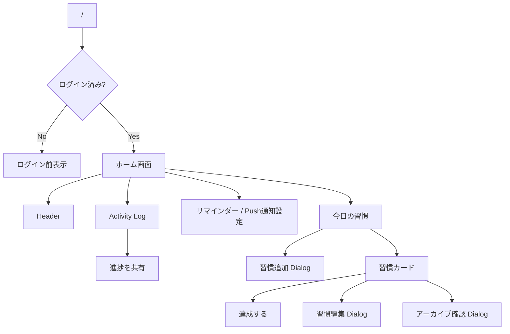

# UI 設計書

Daily Green の現行 UI を Markdown + Mermaid で管理する。

## 位置づけ

- API 設計と React / TanStack Start 実装の間をつなぐ
- ピクセル単位のデザイン固定ではなく、画面責務・状態・操作・API連携・受け入れ条件を記述する
- 主要画面の詳細は [home.md](./home.md) を参照する

## 現行画面スコープ

主要体験はホーム画面 `/` に集約する。

| 種別 | 画面 / UI | Route | 状態 |
| --- | --- | --- | --- |
| Page | ホーム画面 | `/` | 実装済み |
| State | ログイン前表示 | `/` | 実装済み |
| Inline | Activity Log | `/` | 実装済み |
| Inline action | 進捗共有 | `/` | 実装済み |
| Inline settings | Push通知 / リマインダー | `/` | 実装済み |
| Dialog | 習慣追加 | `/` | 実装済み |
| Dialog | 習慣編集 | `/` | 実装済み |
| Dialog | アーカイブ確認 | `/` | 実装済み |
| Inline action | 習慣達成 | `/` | 実装済み |
| Page | アーカイブ済み習慣一覧 | 未定 | 未実装 |

ソーシャルシェア v1 は別ページを持たず、Activity Log 付近の「進捗を共有」操作として提供する。Push通知 v1 も別ページを持たず、ホーム画面のリマインダーカードから設定する。

## 画面構成

## データ取得

ホーム画面は `GET /api/home` から次を取得する。

- `habits[]`
- `activityLog[]`

習慣操作:

- `POST /api/habits`
- `PATCH /api/habits/:id`
- `POST /api/habits/:id/complete`
- `PATCH /api/habits/:id/archive`

Push通知設定:

- `GET /api/notifications`
- `PATCH /api/notifications`
- `PUT /api/notifications`
- `DELETE /api/notifications`

進捗共有は追加 API を呼ばない。現在のホームデータからブラウザ内で PNG を生成する。

## UI 方針

- ライトテーマ固定
- 主アクセントは緑
- Activity Log は contribution graph の発想を使うが GitHub UI をコピーしない
- Dialog は Radix Dialog、操作メニューは Radix Dropdown Menu
- Tailwind CSS で見た目を管理する
- 画面文言は原則日本語、ブランド名 `Daily Green` は英字表記
- 通知権限はページ読み込み時に要求せず、ユーザー操作を起点に要求する

## 関連ドキュメント

- [ホーム画面詳細](./home.md)
- [プロダクト定義](../spec.md)
- [Push通知 v1](../push-notifications.md)
- [ソーシャルシェア v1](../social-share.md)
- [API 設計](../api/README.md)
