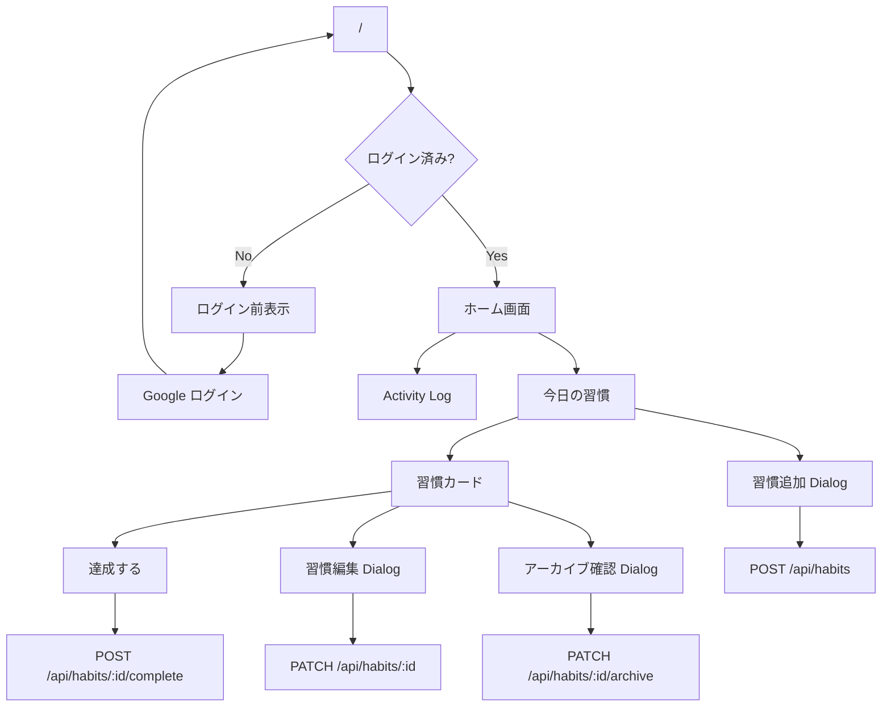
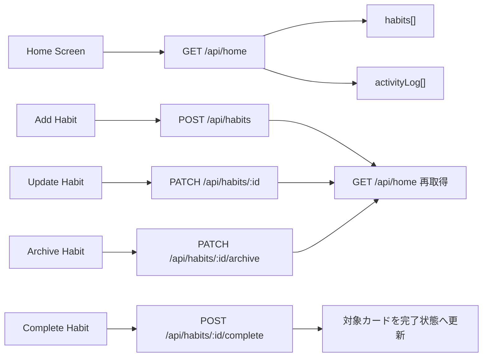

# UI 設計書

Daily Green の MVP 画面設計を Markdown + Mermaid で管理するためのドキュメントです。

## 位置づけ

- 本ディレクトリは、API 設計と実装タスクの間をつなぐ画面設計を記述する
- Figma / Excalidraw / MDX は使わず、GitHub 上でそのまま読める Markdown と Mermaid に限定する
- 画面の見た目をピクセル単位で固定するのではなく、画面責務・状態・操作・API 連携・受け入れ条件を明確にする
- 実装時は本書をもとに React / TanStack Start / TanStack Query の構成へ落とし込む

## MVP 画面スコープ

MVP では、アプリ固有の主要 UI はホーム画面 `/` に集約する。

| 種別            | 画面 / UI     | Route         | MVP 対象 | 備考                                  |
| ------------- | ----------- | ------------- | ------ | ----------------------------------- |
| Page          | ホーム画面       | `/`           | Yes    | ログイン後の主要画面。Activity Log と今日の習慣を表示する |
| State         | ログイン前表示     | `/`           | Yes    | 未ログイン時に Google ログイン導線を表示する          |
| Dialog        | 習慣追加        | `/` 上の Dialog | Yes    | `POST /api/habits` を呼ぶ              |
| Dialog        | 習慣編集        | `/` 上の Dialog | Yes    | `PATCH /api/habits/:id` を呼ぶ         |
| Dialog        | アーカイブ確認     | `/` 上の Dialog | Yes    | `PATCH /api/habits/:id/archive` を呼ぶ |
| Inline action | 習慣達成        | `/` 上の Card   | Yes    | `POST /api/habits/:id/complete` を呼ぶ |
| Page          | アーカイブ済み習慣一覧 | 未定            | No     | MVP では提供しない                         |
| Page          | 習慣詳細ページ     | 未定            | No     | MVP では別ページを提供せず、編集は Dialog で行う      |
| Page          | シェア / 通知設定  | 未定            | No     | 将来拡張                                |

## 画面構成

## データ取得方針

## 設計上の決定

### 1. 画面は `/` に集約する

API 仕様上、ホーム画面の描画に必要なデータは `GET /api/home` に集約されているため、MVP の主要体験は `/` に集約する。

### 2. 習慣追加は別ページではなく Dialog にする

MVP の入力項目は `name` と任意の `emoji` のみであり、ホーム画面の「今日の習慣」からすぐ追加できる体験が自然なため、別ページではなく Dialog とする。

### 3. アーカイブは習慣カードのメニューから行う

削除 API は存在せず、MVP ではアーカイブ扱いに統一されているため、習慣カードのメニューから「アーカイブ」を選択し、確認 Dialog で実行する。

### 4. 習慣編集は習慣カードのメニューから Dialog で行う

習慣の表示項目は `PATCH /api/habits/:id` で `name` と `emoji` のみ更新できる。詳細ページは作らず、習慣カードのメニューから編集 Dialog を開き、作成 Dialog と同等の入力制約で更新する。

アーカイブ済み習慣はホーム画面に表示しないため、MVP の編集対象は active habit のみとする。更新後は `GET /api/home` を再取得し、Activity Log と今日の習慣表示を API の最新状態にそろえる。

### 5. 達成済みカードは再操作不可にする

Undo API が存在せず、プロダクト仕様でも完了済みカードは再操作不可とされているため、達成済みのカードは disabled 表示にする。

### 6. Activity Log は閲覧専用にする

MVP では過去日の修正や遅延達成は提供しないため、Activity Log は日次達成率の可視化に限定する。セルクリックによる詳細表示は MVP では扱わない。

## ファイル一覧

| ファイル                | 内容                      |
| ------------------- | ----------------------- |
| `docs/ui/README.md` | UI 設計全体の方針、画面スコープ、画面構成  |
| `docs/ui/home.md`   | ホーム画面の詳細設計、状態、操作、受け入れ条件 |

