# Home Screen UI 設計

## Route

`/`

## 目的

ユーザーが今日の習慣達成状況を確認し、その場で習慣を達成・追加・編集・アーカイブできる画面。

MVP では、ホーム画面がアプリの中心画面となる。

## MVP UI 共通方針

- テーマはライト固定とする。dark mode の切替は提供せず、OS の `prefers-color-scheme: dark` でもライト表示を維持する。必要に応じて `color-scheme: light` を指定する。
- 背景は白〜ごく薄いニュートラル、主アクセントは緑とする。落ち着いたシンプルな SaaS UI とし、過度なゲーミフィケーションは行わない。
- Activity Log は GitHub の contribution graph を連想できる表示とするが、GitHub UI をコピーしない。
- 画面上の文言は原則日本語とする。ブランド名の `Daily Green` はそのまま表示する。
- Dialog には Radix Dialog、操作メニューには Radix Dropdown Menu を使用する。shadcn/ui は導入しない。
- 見た目は Daily Green 側の Tailwind CSS で管理し、Toast、chart、icon のライブラリは追加しない。

## ユーザーができること

- Google アカウントでログインする
- 今日の対象習慣を確認する
- 未達成の習慣を達成済みにする
- 新しい習慣を追加する
- 既存の習慣の名前と絵文字を編集する
- 不要になった習慣をアーカイブする
- 直近 365 日の Activity Log を見る

## 画面構造

### Desktop

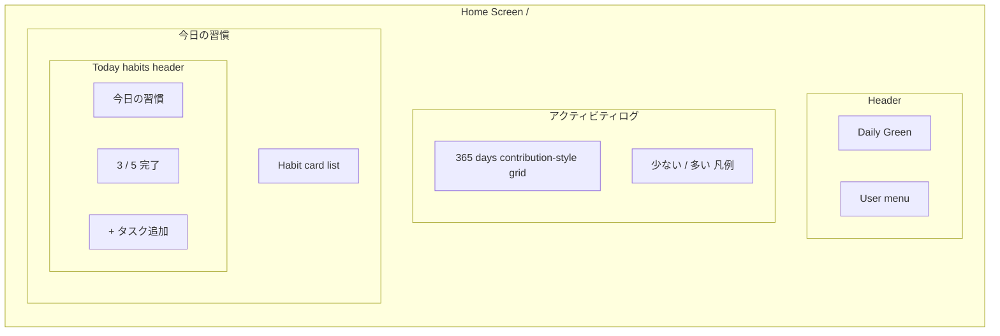

### Mobile

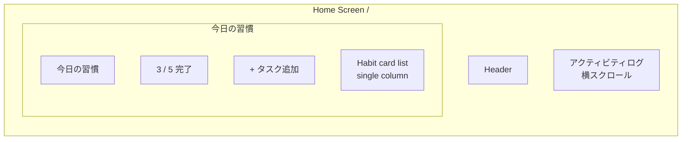

## コンポーネント構成

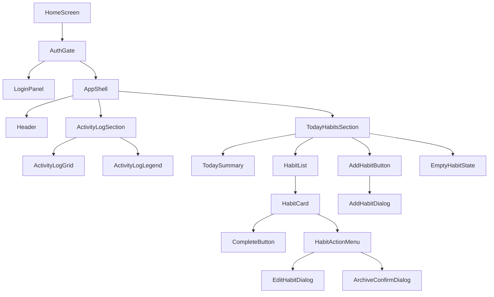

## データ依存

### 初期表示

| 用途 | API / Source | 備考 |
| --- | --- | --- |
| セッション確認 | Better Auth client | 未ログイン時はログイン前表示 |
| ホームデータ | `GET /api/home` | `habits` と `activityLog` を取得する |

### 操作

| 操作 | API | 成功時 |
| --- | --- | --- |
| 習慣追加 | `POST /api/habits` | Dialog を閉じ、`["home"]` を invalidate して `GET /api/home` を再取得 |
| 習慣更新 | `PATCH /api/habits/:id` | Dialog を閉じ、`["home"]` を invalidate して `GET /api/home` を再取得 |
| 習慣達成 | `POST /api/habits/:id/complete` | レスポンスの `habit` で対象カードを更新 |
| 習慣アーカイブ | `PATCH /api/habits/:id/archive` | Dialog を閉じ、`["home"]` を invalidate して `GET /api/home` を再取得 |
| ログアウト | Better Auth client | ユーザーに紐づくホームキャッシュを破棄してログイン前表示へ戻す |

### 認証・ホームデータの取得

- セッション確認中は簡潔な `読み込み中…` を表示する。未認証時はログイン前表示だけを表示し、ホームデータは取得しない。
- ログイン前表示には `Daily Green`、`毎日の習慣を記録して、積み上げを振り返りましょう。`、Google ログイン導線を表示する。開発環境や DB の内部事情を示す文言はプロダクト UI に出さない。ログイン失敗時は `ログインに失敗しました。もう一度お試しください。` と表示する。
- 認証済みの場合だけホームデータを取得する。TanStack Query を使う場合の query key は `['home']`、`staleTime` は `0` とする。window focus と reconnect 時は再取得する。
- `401 UNAUTHORIZED` を受け取ったらホームキャッシュを破棄してセッションを再確認し、未認証 UI へ戻す。別ユーザーへの切替時や明示的なログアウト後に、前ユーザーの `['home']` キャッシュを表示してはならない。
- `401` を含む 4xx は自動 retry しない。network error と 5xx の retry は多くても 1 回に制限し、無限 retry や長い retry は行わない。

## UI 状態

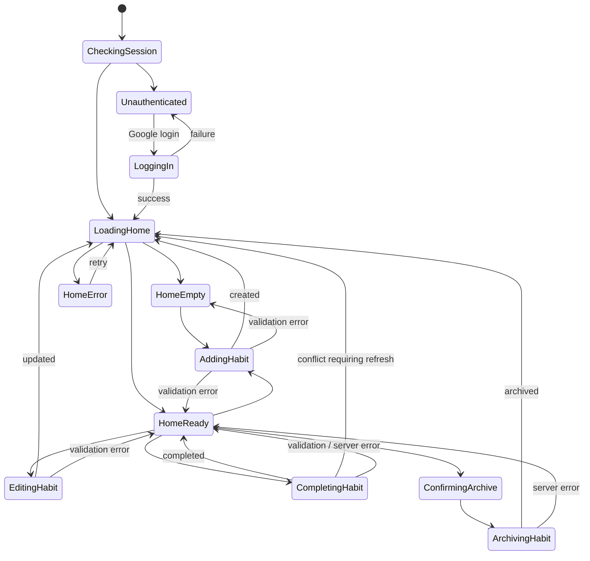

## 主要セクション

### Header

表示内容:

| 項目 | 内容 |
| --- | --- |
| アプリ名 | `Daily Green` |
| ユーザー情報 | 画像があれば avatar とユーザー名。メールアドレスの常時表示は不要 |
| 操作 | ログアウト |

主要画面が `/` のみであるため、グローバルナビゲーションは配置しない。

ログアウト中は二重実行を防ぐ。成功時はユーザーに紐づくキャッシュを破棄し、安全にログイン前表示へ戻す。

### Activity Log

表示内容:

| 項目 | 内容 |
| --- | --- |
| 対象期間 | 今日を含む直近 365 日 |
| 表示形式 | contribution-style grid |
| 凡例 | `少ない` / `多い` |
| セル状態 | `null` / `0` / level 1〜4 |

#### 色レベル

| 値 | 表示 |
| --- | --- |
| `completionRate === null` | 未確定または対象なし |
| `completionRate === 0` | 達成なし |
| `0 < completionRate <= 0.25` | level 1 |
| `0.25 < completionRate <= 0.50` | level 2 |
| `0.50 < completionRate < 1.00` | level 3 |
| `completionRate === 1.00` | level 4 |

#### グリッド・日付・表示責務

`ActivityLog` は `activityLog` を受け取って描画する pure な表示コンポーネントとする。コンポーネント自身は fetch、auth、TanStack Query、mutation を扱わず、chart library も使用しない。

- API の実データ 365 件をすべて表示する。1 列を 1 週間、7 行を曜日、日曜始まりとし、左を過去、右を最新とする。
- 先頭日付の曜日位置合わせには placeholder を置く。末尾も週レイアウトを完成させるために必要なら placeholder を置く。placeholder はデータセル数に含めず、達成率、`aria-label`、hover state を持たない。
- API の `YYYY-MM-DD` は date-only 値としてタイムゾーン非依存に処理する。曜日・月の算出を `new Date()` のローカル時刻解釈に依存させず、UTC component を使う等の安全な方法を選ぶ。
- 月ラベル（例: `1月`）を各月の最初の週付近に表示する。曜日ラベルは省スペースのため `月`、`水`、`金` だけを表示してよいが、内部グリッドは全 7 曜日とする。
- 凡例は `少ない □ ■ ■ ■ ■ 多い` とする。`null` と `0` は異なる見た目とし、positive level 1〜4 は明確な緑の 4 段階で、値が高いほど濃くする。dark variant は作らない。

Activity Log のセルクリック操作は提供しない。各実データセルには日付と達成率を示す `aria-label` を付与する。365 セルを Tab stop にして keyboard focus を過剰に増やさない。

`aria-label` 例:

```txt
2026-06-19: 達成率 80%
2026-06-20: 達成率 0%
2026-06-21: 未確定または対象なし
```

`completionRate: null` の理由は、当日未確定と対象習慣なしを API 上区別しないため、UI でも同一表示にする。

### 今日の習慣

表示内容:

| 項目 | 内容 |
| --- | --- |
| セクションタイトル | `今日の習慣` |
| 完了数サマリー | `3 / 5 完了` |
| 追加操作 | `+ タスク追加` |
| 一覧 | active habit のカード一覧 |

完了数サマリーは `GET /api/home` の `habits` からクライアント側で算出する。

```ts
completedCount = habits.filter((habit) => habit.isCompletedToday).length;
totalCount = habits.length;
```

対象習慣が 0 件の場合は空状態を表示する。`今日の習慣` セクションの追加 CTA は見出し側の `+ タスク追加` の 1 つだけとし、空状態の本文には追加 CTA を重複表示しない。0 件時に `0 / 0 完了` を表示する必要はない。

```txt
今日の習慣はまだありません。
まずは小さな習慣を1つ追加しましょう。
```

## 習慣カード

### 構造

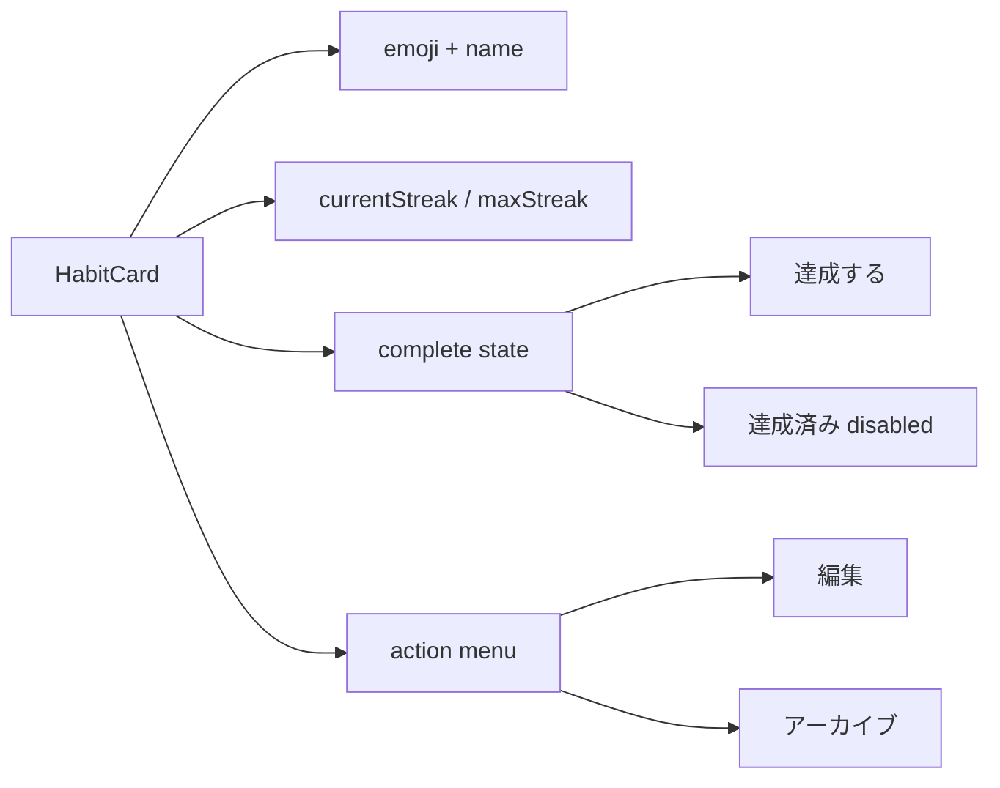

### 表示項目

| 項目 | 表示 |
| --- | --- |
| `emoji` | 未設定時はプレースホルダーを補わず非表示 |
| `name` | 習慣名 |
| `currentStreak` | 現在の連続達成日数 |
| `maxStreak` | 過去最高の連続達成日数 |
| `isCompletedToday` | 達成済み表示・ボタン状態に反映 |

### 未達成状態

| 要素 | 表示 |
| --- | --- |
| メイン | `📚 読書する` |
| ストリーク | `現在 3日 ・ 最長 14日` |
| 完了操作 | `達成する` |
| メニュー | `編集` / `アーカイブ` |

### 達成済み状態

| 要素 | 表示 |
| --- | --- |
| メイン | `📚 読書する` |
| ストリーク | `現在 4日 ・ 最長 14日` |
| 完了操作 | `✓ 達成済み` disabled |
| メニュー | `編集` / `アーカイブ` |

達成済み状態では:

- 完了ボタンを disabled 表示にする
- `POST /api/habits/:id/complete` を再実行しない
- 二重達成エラーを通常導線では発生させない

### 操作中状態と同時操作

- complete のリクエスト中は、そのカードだけを `達成しています…` と disabled にし、二重送信を防ぐ。別の習慣は操作可能とする。
- 同一 habit の complete / edit / archive は通常 UI から同時に開始させない。mutation の pending 状態を同一 habit 間で共有検知し、操作メニュー、完了操作、各 Dialog の送信を適切に無効化する。
- 追加、編集、アーカイブの Dialog は送信中、入力、送信、キャンセルを disabled にし、Esc と外側クリックによる close も抑止する。送信中の文言はそれぞれ `追加しています…`、`保存しています…`、`アーカイブしています…` とする。
- API 失敗時は Dialog を閉じず、入力内容と Dialog 内エラーを維持する。
- 通常状態の Cancel、Esc、外側クリックによる close では、フォーム値とエラーを reset する。次回の追加 Dialog は空フォーム、編集 Dialog は選択した習慣の最新の `name` / `emoji` を初期値とする。
- Dialog を通常 close または成功で閉じた後は、追加 Dialog では追加ボタン、編集・アーカイブ Dialog では操作メニューの適切な起点へ focus を戻す。

## 習慣追加 Dialog

### 起動

`今日の習慣` セクションの `タスク追加` ボタンから開く。

### フォーム構造

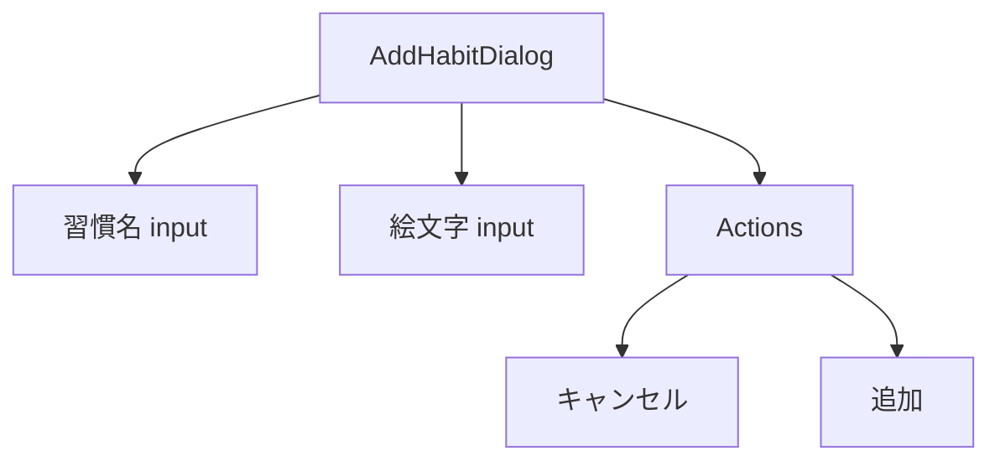

### 入力項目

| 項目 | 必須 | 制約 | UI |
| --- | --- | --- | --- |
| 習慣名 | Yes | 最大 50 文字、空白のみ不可 | Text input |
| 絵文字 | No | 1 つの絵文字グラフェムクラスタ | Text input |

### バリデーション

| 条件 | 表示 |
| --- | --- |
| 習慣名が空 | `習慣名を入力してください` |
| 習慣名が空白のみ | `習慣名を入力してください` |
| 習慣名が 50 文字超過 | `習慣名は50文字以内で入力してください` |
| 絵文字が複数文字 | `絵文字は1つだけ入力してください` |
| 絵文字ではない文字が入力された | `絵文字を1つだけ入力してください` |
| 作成上限 | `これ以上、習慣を作成できません` |

クライアントとサーバーで別々に判定を実装せず、`Intl.Segmenter` によるグラフェム数と RGI Emoji 判定を含む pure な shared validation helper を両者で再利用する。server の既存 validation semantics は変更しない。習慣名は `trim` 後に空白のみ不可・最大 50 grapheme、絵文字は空文字または RGI Emoji 1 grapheme とする。HTML の `maxLength` は authoritative validation にせず、ZWJ や skin tone 付き emoji を壊さない。

バリデーションエラーは submit 時に表示し、該当フィールドの編集後には適切に解消する。typing 中に過度なエラー表示は行わず、クライアントバリデーションに失敗した場合は API を呼ばない。

サーバーから `INVALID_REQUEST` が返った場合は、Dialog 内に `message` を表示する。

### 送信フロー

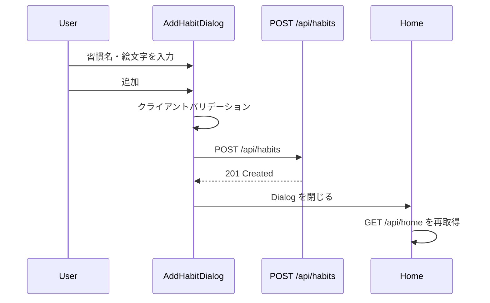

## 習慣編集 Dialog

### 起動

習慣カードのメニューから `編集` を選択して開く。

### フォーム構造

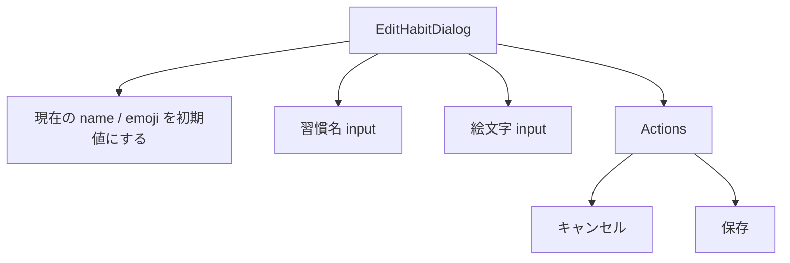

### 入力項目

| 項目 | 必須 | 制約 | UI |
| --- | --- | --- | --- |
| 習慣名 | Yes | 最大 50 文字、空白のみ不可 | Text input |
| 絵文字 | No | 空文字または 1 つの絵文字グラフェムクラスタ | Text input |

絵文字 input を空にして保存すると、`emoji: ""` として更新する。

### バリデーション

| 条件 | 表示 |
| --- | --- |
| 習慣名が空 | `習慣名を入力してください` |
| 習慣名が空白のみ | `習慣名を入力してください` |
| 習慣名が 50 文字超過 | `習慣名は50文字以内で入力してください` |
| 絵文字が複数文字 | `絵文字は1つだけ入力してください` |
| 絵文字ではない文字が入力された | `絵文字を1つだけ入力してください` |

追加 Dialog と同じ shared validation helper を再利用する。HTML の `maxLength` だけで検証せず、名前は最大 50 grapheme、絵文字は空文字または RGI Emoji 1 grapheme とする。

サーバーから `INVALID_REQUEST` が返った場合は、Dialog 内に `message` を表示する。

### 送信フロー

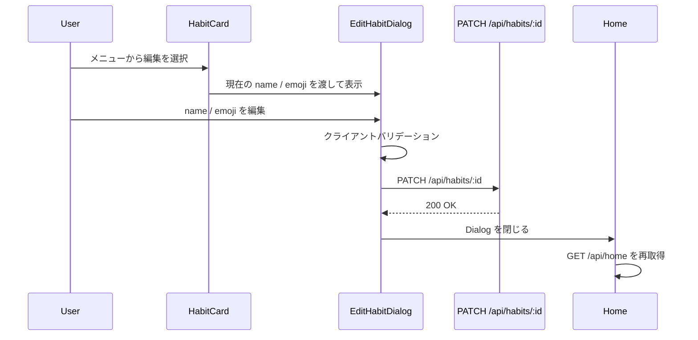

### 更新失敗時

| Error code | UI |
| --- | --- |
| `INVALID_REQUEST` | Dialog 内に `message` を表示 |
| `HABIT_ARCHIVED` | `この習慣はすでにアーカイブされています` を表示し、ホームデータを再取得 |
| `HABIT_NOT_FOUND` | `習慣が見つかりません` を表示し、ホームデータを再取得 |
| `UNAUTHORIZED` | ログイン前表示へ戻す |
| `INTERNAL_SERVER_ERROR` | `処理に失敗しました。時間をおいて再試行してください` を表示 |

## 習慣達成フロー

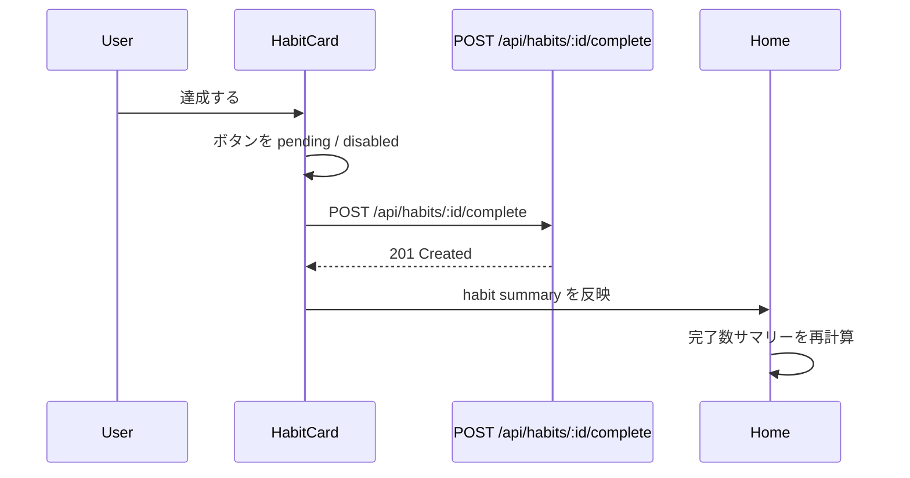

### 達成成功時

- 対象カードの `isCompletedToday` を `true` にする
- `currentStreak` / `maxStreak` をレスポンスの `habit` で更新する
- 完了ボタンを `達成済み` に変更し disabled にする
- 完了数サマリーを更新する

Activity Log の当日 `completionRate` は API 仕様上 `null` のため、達成直後に今日セルの色は更新しない。

### 達成失敗時

| Error code | UI |
| --- | --- |
| `HABIT_ARCHIVED` | `この習慣はすでにアーカイブされています` を表示し、ホームデータを再取得 |
| `HABIT_ALREADY_COMPLETED_TODAY` | `この習慣は本日すでに達成済みです` を表示し、ホームデータを再取得した結果を正とする |
| `HABIT_NOT_FOUND` | `習慣が見つかりません` を表示し、ホームデータを再取得 |
| `UNAUTHORIZED` | ログイン前表示へ戻す |
| `INTERNAL_SERVER_ERROR` | `処理に失敗しました。時間をおいて再試行してください` を表示 |

## アーカイブ操作

習慣カードのメニューから `アーカイブ` を選択する。

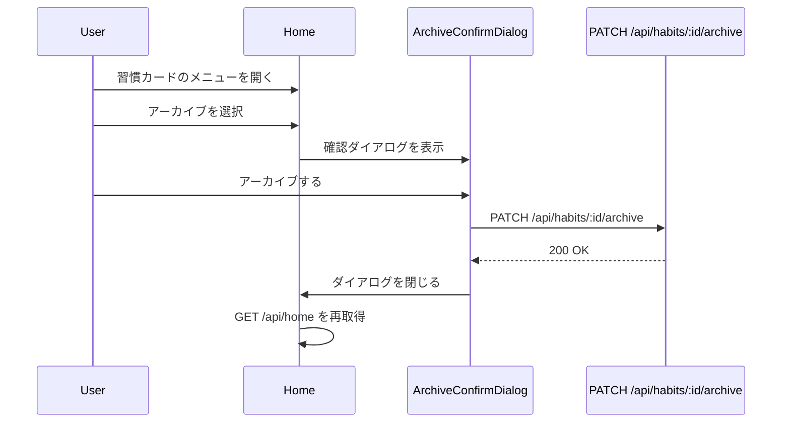

確認文言:

```txt
「読書する」をアーカイブしますか？

アーカイブした習慣は今日の習慣に表示されなくなります。
アーカイブ済み習慣の復元 UI はありません。
```

画面文言を「削除」に置き換えず、MVP では復元 UI を追加しない。API は冪等であるため、すでにアーカイブ済みの habit に対する `200 OK` も成功として扱う。

## エラー表示

### 初期表示エラー

`GET /api/home` が失敗した場合:

```txt
データの取得に失敗しました。
[再読み込み]
```

`401 UNAUTHORIZED` の場合はログイン前表示に戻す。

初回ロードに失敗して表示可能なデータがない場合だけ、上記の page-level error を表示する。すでにキャッシュ済みのホームデータがあり、window focus や reconnect 等による background refetch だけが失敗した場合は、既存の Activity Log と習慣一覧を消さない。画面内の非ブロッキングな inline message または banner で `最新データの取得に失敗しました。` と再取得可能であることを知らせる。

### 操作エラー

追加・編集・達成・アーカイブの操作エラーは、以下のルールで表示する。

| 種別 | 表示場所 |
| --- | --- |
| 入力不正 | Dialog 内 |
| 上限到達 | AddHabitDialog 内 |
| 達成失敗 | HabitCard 付近の inline message |
| 編集対象が存在しない | Dialog 内 message を表示後に `GET /api/home` を再取得 |
| アーカイブ対象が存在しない | Dialog 内 message を表示後に `GET /api/home` を再取得 |

新しい Toast dependency は追加しない。エラー表示は page-level error、Dialog 内 error、HabitCard 付近の inline error で完結させる。エラー文言は原則として API の `message` を使うか、次の日本語文言を使用する。

| 条件 | 表示文言 |
| --- | --- |
| `HABIT_ARCHIVED` | `この習慣はすでにアーカイブされています` |
| `HABIT_ALREADY_COMPLETED_TODAY` | `この習慣は本日すでに達成済みです` |
| `HABIT_NOT_FOUND` | `習慣が見つかりません` |
| `INTERNAL_SERVER_ERROR` | `処理に失敗しました。時間をおいて再試行してください` |
| network error | `通信に失敗しました。接続を確認して再試行してください` |

`HABIT_ARCHIVED`、`HABIT_NOT_FOUND`、`HABIT_ALREADY_COMPLETED_TODAY` は、クライアント表示が DB より古い可能性が高い stale-state error として扱う。ユーザー向けエラーを表示したうえで `['home']` を invalidate / refetch し、ストリークや完了状態をクライアント側で推測して補正しない。再同期後に解消した stale-state error は表示し続けない。

## レスポンシブ方針

### Desktop

- コンテンツ最大幅を設定し、中央寄せ
- Activity Log を上部に横長表示
- 習慣カードは 1 カラムで縦並びにする
- active habit は最大 10 件のため、ページングは提供しない

### Mobile

- 画面全体を 1 カラムにする
- Activity Log は横スクロール表示にする
- Activity Log は最新日、つまり今日側が初期表示されるように、右端へ初期スクロールまたは右寄せ表示する
- タスク追加ボタンは `今日の習慣` 見出しの下に配置する
- 習慣カードの操作ボタンはカード幅いっぱいに配置する
- 習慣カードのメニューはカード右上に配置する

Activity Log は mobile では横スクロールとし、最初の表示時だけ今日側（右端）を初期表示する。ユーザーが過去へスクロールした後、background refetch ごとに右端へ戻してはならない。

## アクセシビリティ

- すべてのボタンは keyboard 操作可能にする
- Dialog 表示中は focus trap を行う
- Dialog を閉じたら起動ボタンへ focus を戻す
- 達成済みボタンは disabled と視覚表現の両方で状態を示す
- Activity Log は色だけに依存せず、セルに `aria-label` を付与する
- HabitActionMenu は `aria-label` で対象習慣名を含める
- Dialog には title と input の label を関連付け、バリデーションエラーと入力欄も関連付ける。送信中であることも支援技術から認識可能にする。
- エラーを動的に表示する領域には適切な `role="alert"` を付与する。操作中・disabled・完了済みの状態は色だけに依存しない。
- ライトテーマでも十分な文字色・背景色のコントラストと visible focus ring を確保する。

HabitActionMenu の `aria-label` 例:

```txt
読書する の操作メニュー
```

## 受け入れ条件

### ログイン前

- 未ログイン時に Google ログイン導線が表示される
- ログイン成功後、ホーム画面のデータ取得が行われる
- ログイン失敗時にエラーメッセージが表示される

### ホーム画面

- `GET /api/home` の `activityLog` を Activity Log として表示する
- `GET /api/home` の `habits` を今日の習慣として表示する
- 習慣カードは API の返却順を維持する
- `habits.length === 0` の場合、空状態を表示する
- 完了数サマリーを `isCompletedToday` から算出する
- 達成済みカードは再操作不可である
- 習慣カードのメニューから編集とアーカイブを開始できる

### 習慣追加

- `タスク追加` ボタンから Dialog を開ける
- 習慣名と任意の絵文字を入力できる
- クライアント側で空文字・空白のみ・50文字超過を検知できる
- `POST /api/habits` 成功後、Dialog が閉じる
- 作成後、ホーム画面のデータが再取得される
- `HABIT_LIMIT_EXCEEDED` をユーザーが理解できる文言で表示する

### 習慣編集

- 習慣カードのメニューから EditHabitDialog を開ける
- Dialog には現在の `name` と `emoji` が初期値として表示される
- 習慣名と絵文字を編集できる
- 絵文字を空にして保存すると、絵文字未設定として更新される
- クライアント側で空文字・空白のみ・50文字超過を検知できる
- `PATCH /api/habits/:id` 成功後、Dialog が閉じる
- 更新後、ホーム画面のデータが再取得される
- `HABIT_ARCHIVED` をユーザーが理解できる文言で表示する

### 習慣達成

- 未達成カードの `達成する` ボタンで `POST /api/habits/:id/complete` を呼ぶ
- 成功後、対象カードが達成済み表示になる
- 成功後、完了数サマリーが更新される
- 送信中の二重クリックを防止する
- `HABIT_ALREADY_COMPLETED_TODAY` ではホームデータを再取得し、サーバーから返る状態を正とする

### アーカイブ

- 習慣カードからアーカイブ操作を開始できる
- 実行前に確認 Dialog を表示する
- `PATCH /api/habits/:id/archive` 成功後、ホーム画面データを再取得する
- アーカイブ後、その習慣は今日の習慣一覧に表示されない
- アーカイブ済み習慣の一覧・復元 UI は表示しない

## データ更新方針

- `POST /api/habits` 成功後は `GET /api/home` を再取得する
- `PATCH /api/habits/:id` 成功後は `GET /api/home` を再取得する
- `PATCH /api/habits/:id/archive` 成功後は `GET /api/home` を再取得する
- `POST /api/habits/:id/complete` 成功後はレスポンスの `habit` summary で対象カードを更新する
- 達成成功時の更新は optimistic update ではなく、サーバー成功後の response-driven update とする。今日の `completionRate` は API 仕様上 `null` のため、complete 成功時に Activity Log をクライアント側で書き換えない。
- TanStack Query を使う場合、ホームデータの query key は `["home"]` とする
- `GET /api/home` は Lazy Update を伴うため、stale time は `0` とする
- クライアントは JST 00:00 到達時に `["home"]` を invalidate / refetch し、日付跨ぎ後の `isCompletedToday` と Lazy Update 済み streak を反映する。client clock は refetch を予約するタイミングだけに用い、今日、`daily_record` の日付、期限、streak の業務判定には使わない。
- JST の次の 00:00 に 1 回だけ timer を設定し、発火後は invalidate / refetch 完了後にさらに翌日の timer を再設定する。unmount、認証状態の切替、timer の再設定時は以前の timer を cleanup する。
- window focus / reconnect 時にも `GET /api/home` を再取得し、長時間開きっぱなしの表示ずれを補正する
