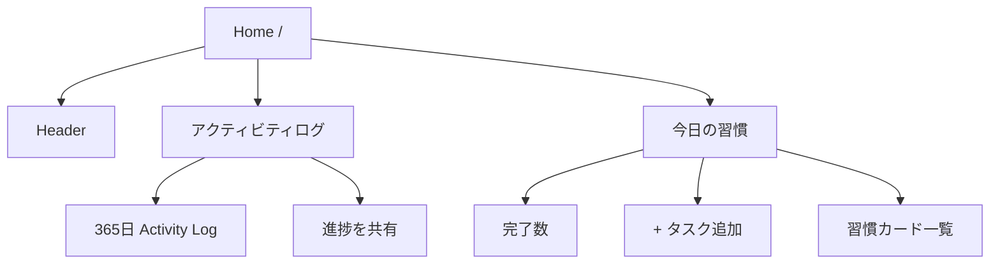

# Home Screen UI 設計

## Route

`/`

## 目的

ユーザーが今日の習慣を確認・達成し、日々の積み上げを Activity Log で振り返り、その進捗を画像として共有できる主要画面。

## 画面構造

主要コンポーネント:

- `HomeScreen`: 認証状態とホームQueryを管理
- `HomeHeader`: ブランド・ユーザー情報・ログアウト
- `HomeMainContent`: Activity Log、共有、今日の習慣を構成
- `ActivityLog`: 365日グリッド
- `ShareButton`: 共有カード生成済みファイルを Web Share API へ渡す
- `TodaySummary`: 今日の完了数
- `HabitList`: 習慣カード一覧
- `AddHabitDialog`: 習慣追加

## 認証状態

### 未ログイン

- ホームデータは取得しない
- `Daily Green` と Google ログイン導線を表示する
- ログイン失敗時は一般ユーザー向けのエラー文言を表示する

### ログイン済み

`GET /api/home` を取得して画面を構成する。

`401 UNAUTHORIZED` を受け取った場合は、前ユーザーのホームキャッシュを残さずセッションを再確認してログイン前状態へ戻す。

## ホームデータ

`GET /api/home` の主な利用項目:

- `habits[]`
- `activityLog[]`

ホームQueryは window focus / reconnect などで再取得し得る。background refetch 中に既存表示を消さず、失敗時は現在表示しているデータを残したまま再試行導線を出す。

## Activity Log

### 表示

- 今日を含む直近365日
- 日曜始まり、1列1週間、7行
- 左が過去、右が最新
- 月ラベルを表示
- 曜日ラベルは省スペースのため `月` / `水` / `金`
- `少ない` / `多い` の凡例を表示

色レベル:

| `completionRate` | 表示 |
| --- | --- |
| `null` | 未確定または対象なし |
| `0` | 達成なし |
| `0 < rate <= 0.25` | level 1 |
| `0.25 < rate <= 0.5` | level 2 |
| `0.5 < rate < 1` | level 3 |
| `1` | level 4 |

セルは情報提示専用で、クリック操作や365個のTab stopを作らない。各実データセルには日付と達成率の `aria-label` / tooltip を付ける。

### モバイル

- Activity Log は横スクロール可能
- 初回表示時だけ最新側へ自動スクロールする
- background refetch や rerender で、ユーザーが移動した横スクロール位置を奪わない
- 左右端までスクロールした際に最端セルを完全に確認できること

## 進捗共有

Activity Log 見出し付近に `進捗を共有` ボタンを表示する。

### 共有カード

ブラウザの Canvas で 1080x1080 PNG を生成する。

含める情報:

- `Daily Green`
- 今日の達成数 `completed / total`
- active habit の最長 `currentStreak`
- 直近365日の Activity Log

含めない情報:

- ユーザー名
- メールアドレス
- 習慣名
- 習慣ID
- Googleアカウント情報
- 達成時刻

### 共有挙動

Web Share API の transient user activation を失わないよう、画像はホームデータ取得後・更新後に事前生成する。

ボタン押下時:

1. 画像ファイル共有が使える場合は PNG + 共有文を `navigator.share()` へ渡す
2. ファイル共有非対応ならテキストのみを `navigator.share()` へ渡す
3. Web Share API 非対応なら Clipboard へ共有文をコピーする
4. ユーザーによる共有キャンセルはエラー表示しない
5. Canvas生成失敗時もテキスト共有 fallback を残す

公開URL・OGPページ・サーバー側画像保存は行わない。

詳細は [../social-share.md](../social-share.md) を参照する。

## 今日の習慣

表示内容:

- `今日の習慣`
- `N / M 完了`
- `+ タスク追加`
- active habit のカード一覧

完了数は `habits.filter(habit => habit.isCompletedToday).length` で算出する。

対象習慣0件では空状態を表示し、追加CTAを重複させない。

## 習慣カード

表示:

- emoji（設定されている場合）
- name
- 現在ストリーク
- 最長ストリーク
- 未達成なら `達成する`
- 編集 / アーカイブ用メニュー

完了済みカードは達成済みであることが分かる見た目にし、再度 complete できない。

## 習慣追加

`+ タスク追加` から Radix Dialog を開く。

入力:

- name: 必須
- emoji: 任意

成功時はDialogを閉じ、ホームデータを再同期する。

## 習慣編集

カードの操作メニューから編集Dialogを開く。

更新対象:

- name
- emoji

成功時はDialogを閉じ、ホームデータを再同期する。

## アーカイブ

カードの操作メニューから確認Dialogを開く。

- 物理削除ではなく archive
- 成功後はホーム一覧から消える
- Activity Log は表示時点の active habit で再集計されるため、過去日の色が変わり得る

## API操作

| 操作 | API | 成功後 |
| --- | --- | --- |
| ホーム取得 | `GET /api/home` | 画面表示 |
| 習慣追加 | `POST /api/habits` | ホーム再同期 |
| 習慣更新 | `PATCH /api/habits/:id` | ホーム再同期 |
| 習慣達成 | `POST /api/habits/:id/complete` | 対象カード更新 + 必要に応じて再同期 |
| アーカイブ | `PATCH /api/habits/:id/archive` | ホーム再同期 |
| 進捗共有 | APIなし | ブラウザ内でPNG生成・共有 |

## レスポンシブ方針

### Desktop

- コンテンツは中央寄せの最大幅を持つ
- Activity Log は可能な限り1画面幅に収める
- 今日の習慣ヘッダーではタイトル・サマリーと追加ボタンを横方向に配置できる

### Mobile

- 習慣カードは1列
- 見出しやボタンは必要に応じて縦積み
- Activity Log は横スクロール
- 操作ターゲットを小さくしすぎない

## エラー表示

- 初回ホーム取得失敗: 再読み込み導線を表示
- background refetch失敗: 既存データを維持し、非破壊の警告を表示
- mutation失敗: 操作対象付近またはDialog内でユーザー向けメッセージを表示
- 認証切れ: キャッシュを破棄して未ログイン状態へ戻す

## 現行スコープ外

- アーカイブ済み習慣一覧
- 過去日の編集
- Activity Logセル詳細画面
- 公開プロフィール
- 公開シェアURL / OGPリンク共有
- 通知設定
